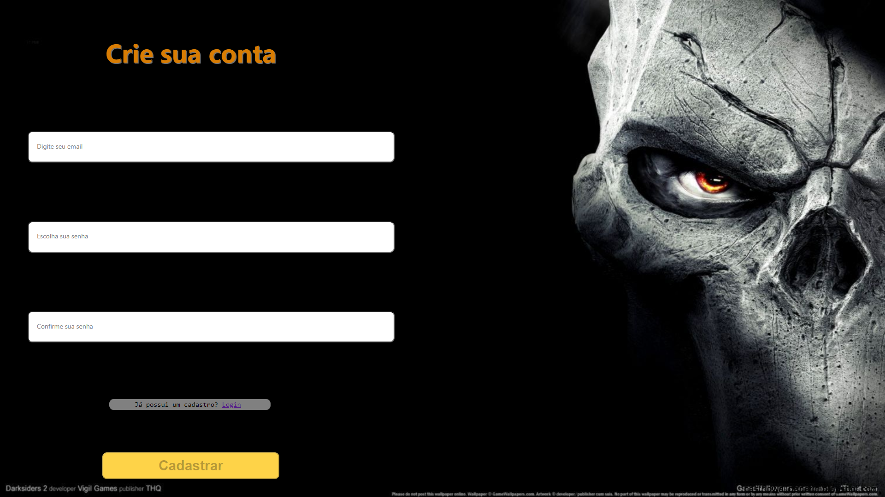

# Olá, bem vindo ao Readme.md do projeto Mix-games

### A idéia do projeto:

A ideia do projeto é criar uma simulação de uma loja que permite que o usuário se registre, faça login, possa registrar jogos, liste os jogos e permita que os jogos sejam adicionados ao carrinho.

### Tecnologias usadas:

##### Backend:

- MongoDB;
- Express;
- JSON Webtoken;
- Nodemon;

###### Front End:

- React;
- CSS;
- HTML;

## Descrição do projeto:

### Tela de Cadastro:

A tela de cadastro é onde o uso do projeto começa. Nela é preciso preencher quatro campos - Seu nome, seu email, senha;

Esses quatro campos têm avisos para cada um deles quando os dados preenchidos são inválidos;

Quando os dados são válidos, o botão "Cadastrar" é liberado e permite que o usuário se registre.

### Tela de Login:

Essa tela como o nome diz, serve para fazer login. Ela precisa de dois dados - Email, senha.

Ela também avisa caso os dados sejam inválidos, e o botão "Entrar" apenas é liberado se os dados forem válidos:

### Tela principal:

Aqui é onde todos os cards dos jogos ficam. Ela também tem a opção para ir à tela de registrar jogos, e visitar o carrinho.

É possível adicionar apenas uma cópia de um jogo no carrinho, depois disso o botão de adicionar no carrinho fica desativado.

### Tela de registro de jogos:

Aqui é onde os jogos são registrados, ela tem quatro campos que pedem o nome do jogo, url da imagem da capa, quantidade de estoque, e preço.

Quando os campos são preenchidos com dados válidos, o botão de submit é desbloqueado.

Assim que o botão é clicado, o usuario é redirecionado para a pagina principal, e o novo jogo é adicionado nela.

### Carrinho:

No carrinho, todos os itens que foram adicionados na pagina principal aparecem numa tabela, com a opção de retirá-los da lista ao clicar no botão "X", além da opção de comprar, e voltar pra pagina principal. Quando o botão "Comprar" é clicado, a quantidade de cada item no estoque é diminuída em um, e o usuário é redirecionado para a página de login.

A tabela de produtos não aparece se o carrinho estiver vazio, apenas é mostrado um aviso, e a opção de voltar à tela principal.

